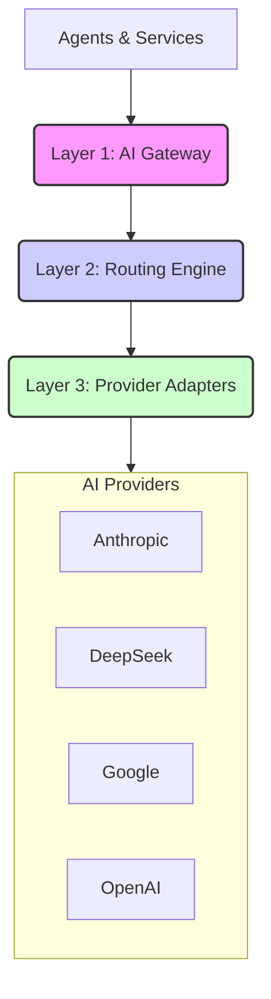
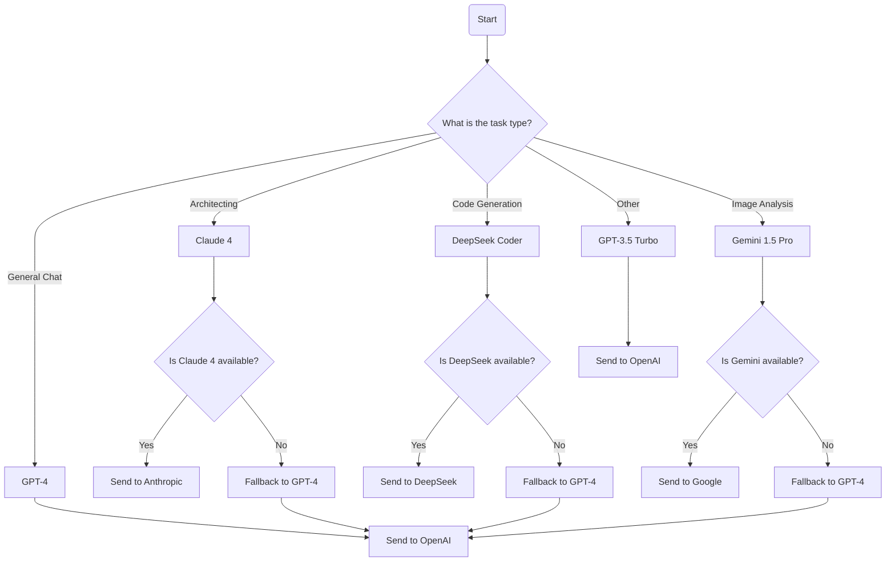

# 11-11 AI Gateway: Design Document

**Author:** Manus AI (Dojo)
**Status:** v1.0 - Final
**Date:** 2025-01-16

---

## 1. Vision & Goals

The 11-11 AI Gateway is a sophisticated, multi-provider AI routing layer designed to transform the platform from a single-model system into a world-class, **Task-Aware Intelligent Routing** platform. The primary goal is to automatically select the absolute best AI model for every job, creating a premium, efficient, and resilient user experience.

This moves 11-11 beyond a simple LLM client and into a true **AI orchestration layer**, capable of leveraging the unique strengths of different providers to achieve superior results.

### Core Principles

- **Right Tool for the Job:** No single model excels at everything. We will use the best model for each specific task (e.g., code generation, high-level reasoning, image processing).
- **Resilience & Redundancy:** The system will automatically failover to a secondary provider if the primary one is unavailable or fails.
- **Performance & Cost Optimization:** The routing engine will consider both performance (latency, quality) and cost to make intelligent decisions.
- **Extensibility:** The architecture will be modular, making it easy to add new providers and models without refactoring the entire system.
- **Observability:** The gateway will provide rich analytics and monitoring to track performance, cost, and usage patterns.

## 2. The Premium AI Stack

The AI Gateway will intelligently route requests to a curated stack of premium models, each chosen for its specific strengths:

| Provider | Models | Best For |
|:---|:---|:---|
| **Anthropic** | Claude 3 Opus, Claude 4 | High-level reasoning, architecting, complex instruction following |
| **DeepSeek** | DeepSeek Coder, DeepSeek LLM | Code generation, technical writing, logical reasoning |
| **Google** | Gemini 1.5 Pro, Gemini Nano Banana | Multimodal understanding, image processing, creative generation |
| **OpenAI** | GPT-4, GPT-3.5 Turbo | General purpose, fallback, user-facing chat |

## 3. Four-Layer Architecture

The AI Gateway is designed as a four-layer system that provides clear separation of concerns and a logical flow of data:

### Layer 1: The AI Gateway (`/lib/ai-gateway/index.ts`)
This is the single entry point for all AI requests in the 11-11 platform. It will replace the existing `LLMClient` and provide a unified interface for all agents and services.

- **Unified Interface:** A single `gateway.call()` method that abstracts away the complexity of multi-provider routing.
- **Context Enrichment:** Automatically enriches requests with metadata (e.g., task type, user ID, session ID) to inform routing decisions.
- **Request Validation:** Ensures all requests conform to a standard schema before being passed to the routing engine.

### Layer 2: The Routing Engine (`/lib/ai-gateway/router.ts`)
This is the brain of the gateway. It receives a request from the gateway and decides which provider and model to use.

- **Task Classifier:** A simple classifier that categorizes the request based on its content and metadata (e.g., `code_generation`, `architectural_design`, `image_analysis`).
- **Model Selector:** A decision tree that selects the best model based on the task type, performance requirements, and cost constraints.
- **Fallback Logic:** A predefined fallback chain for each task type to ensure resilience.
- **Cost Calculator:** Estimates the cost of each request before sending it to the provider.

### Layer 3: Provider Adapters (`/lib/ai-gateway/adapters/`)
A collection of adapters that translate the standardized gateway request into the specific format required by each AI provider.

- **Standardized Interface:** Each adapter implements a common `IProviderAdapter` interface with a `call()` method.
- **Request/Response Mapping:** Maps the standardized request/response objects to/from the provider-specific formats.
- **Error Handling:** Normalizes provider-specific errors into a standardized error format.
- **Authentication:** Handles provider-specific authentication and API key management.

### Layer 4: AI Providers
The external AI services that we integrate with (Anthropic, DeepSeek, Google, OpenAI).

## 4. Task-Aware Intelligent Routing

The core innovation of the AI Gateway is its ability to route requests to the best model for the job. This is achieved through a **Task-Aware Intelligent Routing** system that uses a decision tree to select the optimal provider and model.

### Routing Decision Tree

### Routing Logic

1. **Task Classification:** The router first classifies the incoming request into one of the predefined task types (e.g., `architecting`, `code_generation`, `image_analysis`, `general_chat`). This can be done using simple keyword matching or a more sophisticated classification model.

2. **Primary Model Selection:** Based on the task type, the router selects the primary model from the Premium AI Stack.

3. **Availability Check:** The router checks the status of the primary provider. This can be a simple health check or a more sophisticated real-time status check.

4. **Fallback Logic:** If the primary provider is unavailable, the router selects a fallback model from a predefined chain. The default fallback for most tasks will be GPT-4, as it is a strong general-purpose model.

5. **Cost Estimation:** Before sending the request, the router estimates the cost based on the model and the size of the input. This can be used for budgeting and monitoring.

6. **Dispatch:** The router dispatches the request to the selected provider adapter.

## 5. Provider Adapters

Each provider adapter is a self-contained module responsible for communicating with a specific AI provider. This modular design makes it easy to add new providers without affecting the rest of the system.

### Adapter Responsibilities

- **Authentication:** Securely manage and inject API keys for each provider.
- **Request Formatting:** Transform the standardized gateway request into the provider-specific format.
- **Response Parsing:** Parse the provider-specific response and map it back to the standardized gateway response format.
- **Error Handling:** Catch provider-specific errors and normalize them into a standard error format.
- **Rate Limiting:** Handle provider-specific rate limits and implement retry logic with exponential backoff.

### Example Adapter: Anthropic

The Anthropic adapter will:
1. Receive a standardized request from the router.
2. Format the request according to the Anthropic API documentation (e.g., `messages` array with `role` and `content`).
3. Add the `x-api-key` header with the Anthropic API key.
4. Send the request to the Anthropic API endpoint.
5. Parse the response and extract the `content` from the `content` array.
6. Map the response back to the standardized gateway response format.
7. Handle any errors (e.g., 429 Too Many Requests) and either retry or return a standardized error.
