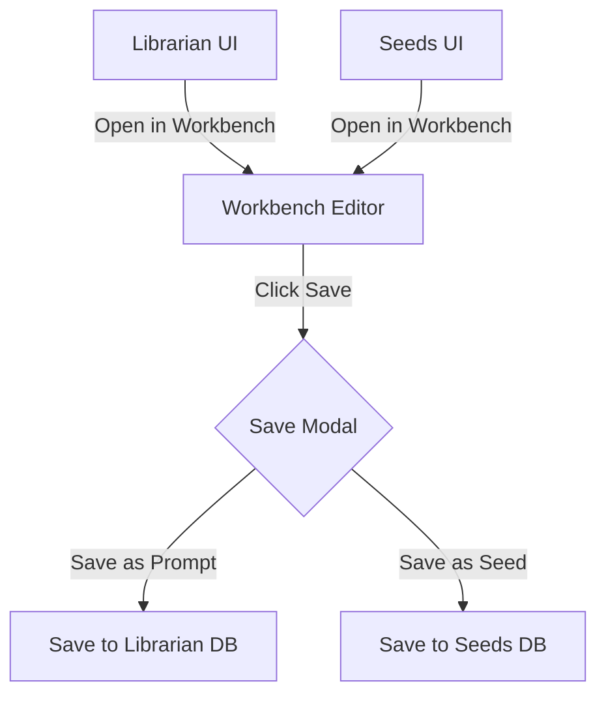

# Sprint 3 Design Specification: The Trinity

**Author:** Manus AI (Dojo)  
**Date:** January 15, 2026  
**Status:** Design specification for the three critical user experience pillars.

---

## 1. Introduction

This document outlines the design and architecture for the three core features of the "Trinity" sprint, which are essential for creating a cohesive and functional user experience in the 11-11 platform. The designs are based on the comprehensive system audit and the user's explicit feedback.

1.  **The Dojo Session Page:** A dedicated chat interface for thinking partnership with the Dojo agent.
2.  **The Workbench File System:** A file explorer for project management within the Workbench.
3.  **The Prompt Bridge:** A seamless workflow for transferring knowledge between the Workbench, Librarian, and Seeds.

---

## 2. Track 1: The Dojo Session Page

This feature addresses the most critical gap: the lack of a dedicated interface for interacting with the Dojo agent. The "New Dojo Session" button on the Dashboard will be rerouted to this new page.

### 2.1. Concept: The Thinking Room

The Dojo Session page will be a full-screen, focused environment designed for deep thinking and collaboration with the AI. It will be inspired by the clean, conversational interfaces of platforms like Zenflow, minimizing distractions and prioritizing the user's thought process.

### 2.2. Page Layout & Components

The page will be located at `/dojo` or `/dojo/{sessionId}` and will consist of the following components:

| Component | Description | Key Features |
| :--- | :--- | :--- |
| **Session History** | A scrollable, chronological view of the entire conversation. | - User inputs and agent responses clearly delineated. - Timestamps for each message. - Code blocks and markdown rendered correctly. |
| **Input Form** | A multi-part input area at the bottom of the page. | - **Situation:** A primary, multi-line textarea for the user's initial query or problem statement. - **Perspectives:** A repeatable field allowing the user to add multiple, distinct perspectives as separate text inputs. - **Submit Button:** A single button to send the complete `DojoPacket` (situation + perspectives) to the Supervisor. |
| **Agent Response** | A structured component for displaying the Dojo agent's output. | - **Mode Indicator:** A clear badge or icon at the top of the response indicating the mode used (e.g., `MIRROR`, `SCOUT`). - **Formatted Content:** The agent's summary, analysis, or plan, rendered with proper formatting. - **Actionable Elements:** For `SCOUT` mode, routes could be presented as clickable buttons. For `GARDENER`, ideas could have "Keep" or "Compost" actions. |
| **Session Management** | A header or sidebar for managing sessions. | - Session title (editable). - "Save Session" button. - A dropdown or list to access past sessions. |

### 2.3. User Flow

1.  User clicks "New Dojo Session" on the Dashboard.
2.  User is redirected to the new, empty Dojo Session page (`/dojo/new`).
3.  User fills out the "Situation" and adds 2-3 "Perspectives."
4.  User clicks "Submit."
5.  The Dojo agent responds, and the response is displayed with a clear Mode Indicator.
6.  The conversation continues, with the user providing more input and the agent responding.

---

## 3. Track 2: The Workbench File System

This feature addresses the inability to manage files within the Workbench, making it a true Integrated Development Environment (IDE).

### 3.1. Concept: The File Explorer

A resizable, vertical panel will be added to the left side of the Workbench editor, displaying a classic file tree structure, similar to VS Code.

### 3.2. Layout & Components

| Component | Description | Key Features |
| :--- | :--- | :--- |
| **File Tree Panel** | A new, resizable panel to the left of the editor. | - Collapsible folder structure. - Icons for different file types. - Draggable for resizing. |
| **File/Folder Items** | Individual items within the tree. | - **Left-click:** Opens the file in a new editor tab. - **Right-click:** Opens a context menu. |
| **Context Menu** | A menu that appears on right-click. | - New File - New Folder - Rename - Delete (with confirmation) |
| **Panel Header** | The top of the File Tree Panel. | - Project name. - Icons for "New File," "New Folder," and "Collapse All." |

---

## 4. Track 3: The Prompt Bridge

This feature creates the essential workflow for saving, loading, and managing prompts and seeds, creating the "centralized editable prompt interface."

### 4.1. Concept: The Save/Load Workflow

The workflow will be initiated from the Workbench and will allow seamless two-way data transfer with the Librarian and Seeds databases.

### 4.2. Workflow Diagram

### 4.3. Components & User Flow

**Saving from Workbench:**
1.  User is editing content in a Workbench tab.
2.  User clicks the "Save" button in the bottom action bar.
3.  A **"Save As..." modal** appears.
4.  The modal contains:
    - **Name/Title** input field.
    - **Description** textarea.
    - **Tags** input (comma-separated).
    - **Save Destination:** Radio buttons for "Prompt (to Library)" or "Seed."
    - **Visibility:** A toggle for "Public (share to Global Commons)."
    - "Save" and "Cancel" buttons.
5.  Upon saving, the content is sent to the appropriate database, and the editor tab is updated with the new name.

**Loading into Workbench:**
1.  User is browsing the Librarian or Seeds page.
2.  Each prompt/seed card has an **"Open in Workbench"** button.
3.  User clicks the button.
4.  The user is redirected to the Workbench.
5.  A new tab is opened, populated with the content of the selected prompt or seed.
6.  The tab is named after the item.
7.  The "Save" button in the action bar now reads **"Update,"** allowing the user to save changes directly back to the original item.
